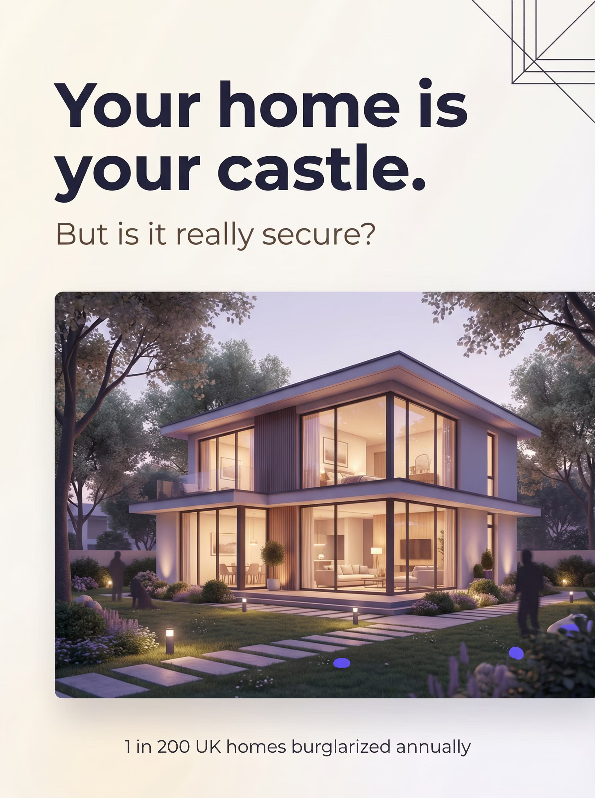

# Ajax Security Systems Website

Професійний landing page для Ajax Security Systems, створений на основі дизайну з Gamma.app.

## Структура файлів

```
ajax-website/
├── index.html          # Основна HTML сторінка
├── style.css           # Файл стилів CSS
├── images/             # Папка з зображеннями
│   ├── Pic1.jpg        # Зображення будинку (hero)
│   ├── Pic2.jpg        # Іконка "Ruins décor"
│   ├── Pic3.jpg        # Іконка "Too complicated"
│   ├── Pic4.jpg        # Іконка "Looks ugly"
│   ├── Pic5.jpg        # Іконка "Fails without power"
│   ├── Pic6.jpg        # Jeweller wireless technology
│   ├── Pic7.jpg        # Design (датчики)
│   ├── Pic8.jpg        # MotionProtect Outdoor
│   ├── Pic9.jpg        # Video surveillance
│   └── Pic10.jpg       # Mobile app
└── README.md           # Цей файл
```

## Встановлення на хостинг

### Варіант 1: Через FTP/SFTP

1. Підключіться до свого хостингу через FTP клієнт (FileZilla, WinSCP)
2. Завантажте всі файли в кореневу директорію сайту (зазвичай `public_html` або `www`)
3. Переконайтеся, що структура папок збережена
4. Відкрийте сайт у браузері

### Варіант 2: Через cPanel File Manager

1. Увійдіть в cPanel вашого хостингу
2. Відкрийте File Manager
3. Перейдіть в папку `public_html`
4. Завантажте всі файли (можна завантажити як ZIP і розпакувати)
5. Перевірте права доступу (файли: 644, папки: 755)

### Варіант 3: Через SSH

```bash
# Підключіться до сервера
ssh your_username@your_server.com

# Перейдіть в директорію сайту
cd /var/www/html  # або /home/user/public_html

# Завантажте файли (через scp або git)
```

## Редагування контенту

### Зміна тексту

Відкрийте `index.html` і знайдіть потрібний текст. Наприклад:

```html
<h1>Your home is your castle.</h1>
```

Просто змініть текст між тегами.

### Заміна зображень

1. Збережіть нове зображення в папці `images/`
2. Відкрийте `index.html`
3. Знайдіть відповідний тег ``:
   ```html
   
   ```
4. Змініть назву файлу на вашу

### Зміна кольорів

Відкрийте `style.css` і знайдіть:

```css
/* Градієнтний фон */
background: linear-gradient(135deg, #667eea 0%, #764ba2 50%, #667eea 100%);

/* Колір тексту */
color: #2d1b4e;

/* Колір кнопки */
background: linear-gradient(135deg, #667eea 0%, #764ba2 100%);
```

Змініть hex-коди кольорів на потрібні.

### Додавання нової секції

Скопіюйте існуючу секцію та змініть вміст:

```html
<section class="custom-section">
    <div class="container">
        <div class="card">
            <div class="card-decoration"></div>
            <h2>Ваш заголовок</h2>
            <p>Ваш текст</p>
        </div>
    </div>
</section>
```

## Особливості

✅ Адаптивний дизайн (працює на телефонах, планшетах, комп'ютерах)
✅ Швидке завантаження
✅ Чистий, валідний HTML5/CSS3 код
✅ Градієнтний фон як в оригіналі
✅ Легко редагувати
✅ SEO-оптимізований
✅ Підтримка всіх сучасних браузерів

## Браузерна підтримка

- ✅ Chrome/Edge (всі версії)
- ✅ Firefox (всі версії)
- ✅ Safari (всі версії)
- ✅ Opera (всі версії)
- ✅ Мобільні браузери

## Оптимізація

### Для швидкості:

1. Зображення вже оптимізовані (формат JPG)
2. CSS мінімізований
3. Немає зайвих скриптів

### Для SEO:

1. Додайте мета-теги в `<head>`:
```html
<meta name="description" content="Professional Ajax Security Systems for your home">
<meta name="keywords" content="ajax, security, alarm, home protection">
```

2. Додайте Google Analytics (якщо потрібно):
```html
<!-- Перед </head> -->
<script async src="https://www.googletagmanager.com/gtag/js?id=YOUR-ID"></script>
```

## Підтримка

Якщо виникли питання або потрібна допомога:
- Перевірте, чи всі файли завантажені
- Переконайтеся, що папка `images` на місці
- Перевірте права доступу до файлів

## Ліцензія

Всі права на дизайн належать Ajax Security Systems.
Код створено для особистого використання.
